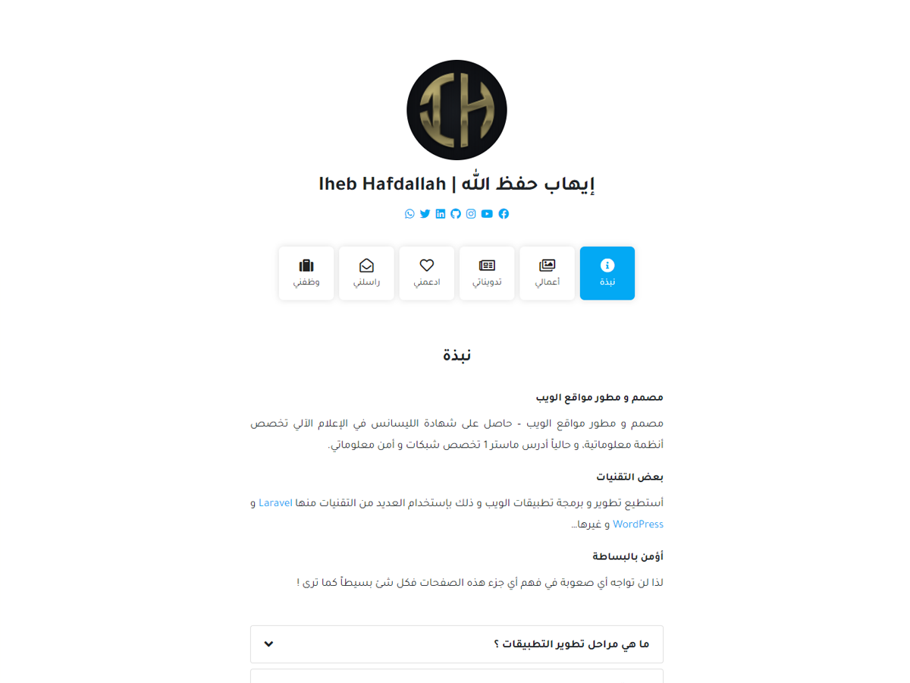

# PersonalWebsite PW-WP - [Demo](https://ihebhafdallah.com/)

<p align="center"><a href="https://laravel.com" target="_blank"></a></p>

This theme was built to be simple and attractive and you can create a personal website with high efficiency

## Preview



## Features

- ✔️ Blog
- ✔️ Links
- ✔️ Donate
- ✔️ Contact Form 
- ✔️ Faqs
- ✔️ Compatible with [Contact Form 7](https://wordpress.org/plugins/contact-form-7/)
- ✔️ SEO optimized [Yoast SEO](https://wordpress.org/plugins/wordpress-seo/)
- ✔️ Fast & lightweight (Google Speed: 99/100)
- ✔️ Simple & Responsive design
- ✔️ Translation ready (with .POT files included)
- ✔️ Right-to-left (RTL) languages support


## Theme installation

1. Simply install as a normal WordPress theme and activate.
2. Make a page called Home(The name is your choice) and set the Page template to Home.
3. Make another page called Blog(The name is your choice) and set the Page template to Blog.
4. In your admin panel, navigate to Settings > Reading.
5. Select A static page (select below) and select the pages created.
6. In your admin panel, navigate to Appearance > Customize.
7. Put the finishing touches on your website by adding a logo, custom colors and etc.
8. Active recommended plugin at the top.

## Theme structure

```shell
themes/PersonalWebsite/           # → Root of your theme
├── assets/                       # → Assets files
│   ├── css/                      # → Compiled CSS file
│   ├── js/                       # → Theme images
│   └── webfonts/                 # → Theme icon fonts
├── languages/                    # → Theme Language files
├── template-parts/               # → Theme Part files (Include)
├── inc/                          # → Theme functions
│   ├── lib/                      # → tgmpa PHP classes
│   ├── custom-controls.php       # → Theme Custom Controls
└── └── customizer.php            # → Theme Customizer
```

## License

PersonalWebsite PW-WP is licensed under [GNU GPL](LICENSE).